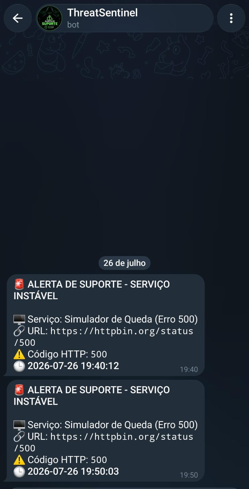

# 🛡️ Monitor de Suporte e Automação (Uptime Checker)

Um sistema automatizado desenvolvido em Python para monitorar a saúde e a disponibilidade de serviços web, APIs e links pessoais, com envio de alertas automáticos em tempo real para o **Telegram**.

---

## 🚀 O que este projeto faz?
* **Varredura Periódica:** Verifica se os sites e APIs configurados estão no ar (retornando status `200 OK`).
* **Alerta Inteligente:** Caso algum serviço caia ou retorne erro, ele dispara um alerta imediato para o seu chat do Telegram.
* **Automação com Cron:** Roda de forma totalmente autônoma em segundo plano no Linux a cada 5 minutos, sem precisar de intervenção humana.

---

## 💻 Exemplo do Sistema em Funcionamento
Aqui está o print do terminal executando o monitor e validando os status dos serviços:


---

## 🛠️ Tecnologias Utilizadas
* **Python 3** (Lógica do script e requisições HTTP)
* **Biblioteca `requests`** (Para testar as conexões)
* **API de Bots do Telegram** (Para a entrega dos alertas)
* **Cron (Linux)** (Para agendamento e automação em segundo plano)

---

## ⚙️ Como Executar o Projeto

1. Clone o repositório:
   ```bash
   git clone [https://github.com/AmandaMRK/ameaça-intel-automação.git](https://github.com/AmandaMRK/ameaça-intel-automação.git)
   cd ameaça-intel-automação

## 📱 Exemplo do Alerta no Telegram
Aqui está como o bot avisa no seu celular quando um serviço apresenta instabilidade:


